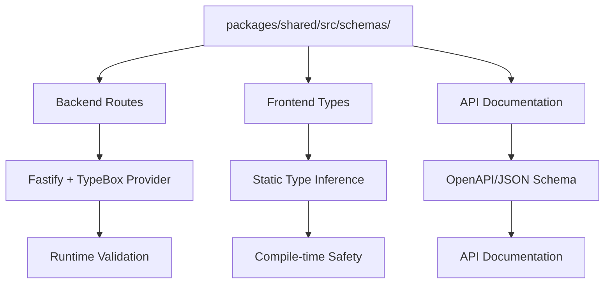
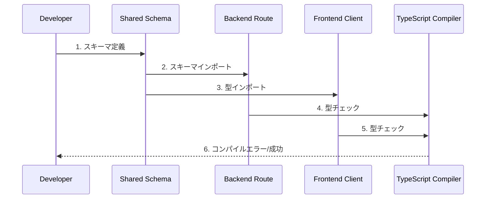
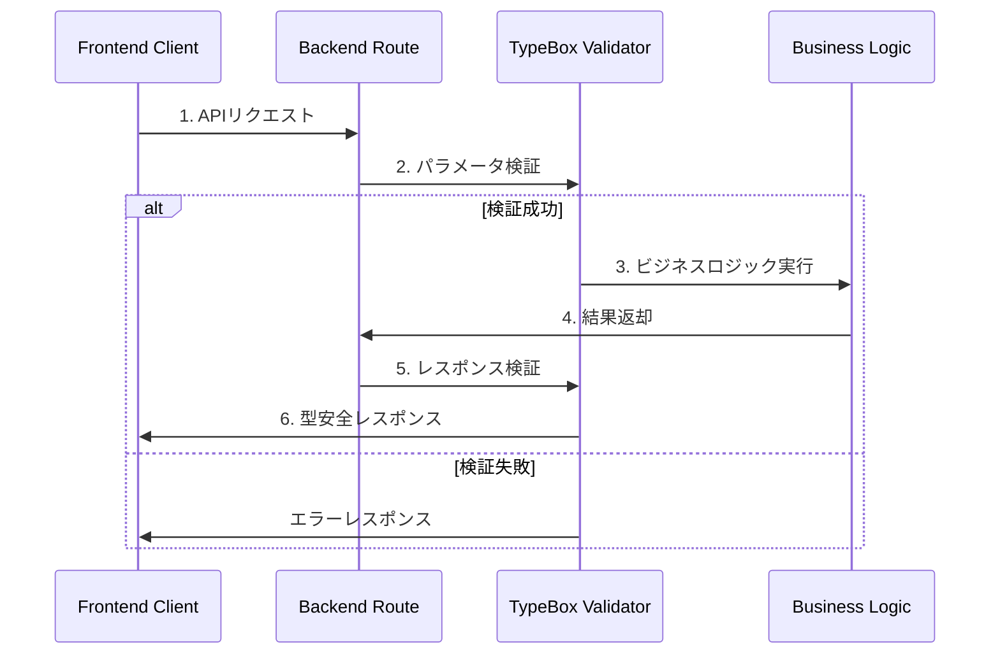

# 設計ドキュメント

## 概要

kiro-lensプロジェクトにTypeBoxベースのスキーマ駆動型開発システムを実装します。@fastify/type-provider-typebox v5.xとTypeScript 5.7.2の最新機能を活用し、sharedパッケージでスキーマを定義してバックエンドとフロントエンドで共有する現代的なアプローチを採用します。これにより、型安全性の向上、開発体験の改善、パフォーマンスの最適化を実現します。

## アーキテクチャ

### システム全体構成



### パッケージ構成

```
packages/
├── shared/
│   ├── src/
│   │   ├── schemas/
│   │   │   ├── api/
│   │   │   │   ├── files.ts          # ファイル関連APIスキーマ
│   │   │   │   ├── projects.ts       # プロジェクト関連APIスキーマ
│   │   │   │   └── common.ts         # 共通APIスキーマ
│   │   │   ├── domain/
│   │   │   │   ├── file-tree.ts      # ファイルツリードメインスキーマ
│   │   │   │   ├── project.ts        # プロジェクトドメインスキーマ
│   │   │   │   └── validation.ts     # バリデーション関連スキーマ
│   │   │   └── index.ts              # スキーマエクスポート
│   │   └── types/
│   │       └── generated.ts          # Static型エクスポート（自動生成）
├── backend/
│   └── src/
│       ├── routes/
│       │   └── files.ts              # TypeBoxスキーマ使用
│       └── app.ts                    # TypeProvider設定
└── frontend/
    └── src/
        └── services/
            └── api.ts                # Static型使用
```

## コンポーネント設計

### 1. 共有スキーマ定義システム

#### TypeBoxスキーマの構造化

```typescript
// packages/shared/src/schemas/api/files.ts
import { Type, Static } from '@sinclair/typebox';

/**
 * プロジェクトファイル取得APIのパラメータスキーマ
 * GET /api/projects/:id/files
 */
export const ProjectFilesParamsSchema = Type.Object(
  {
    id: Type.String({
      format: 'uuid',
      description: 'プロジェクトID（UUID形式）',
      examples: ['550e8400-e29b-41d4-a716-446655440000'],
    }),
  },
  {
    $id: 'ProjectFilesParams',
    title: 'プロジェクトファイル取得パラメータ',
    description: 'プロジェクトのファイルツリーを取得するためのパラメータ',
  }
);

/**
 * APIレスポンスの共通スキーマ
 */
export const ApiResponseSchema = <T extends TSchema>(dataSchema: T) =>
  Type.Object(
    {
      success: Type.Boolean({
        description: 'リクエストが成功したかどうか',
      }),
      data: Type.Optional(dataSchema),
      error: Type.Optional(
        Type.Object(
          {
            type: Type.Union(
              [
                Type.Literal('VALIDATION_ERROR'),
                Type.Literal('NOT_FOUND'),
                Type.Literal('PERMISSION_DENIED'),
                Type.Literal('INTERNAL_ERROR'),
              ],
              {
                description: 'エラーの種類',
              }
            ),
            message: Type.String({
              description: 'エラーメッセージ',
            }),
            timestamp: Type.String({
              format: 'date-time',
              description: 'エラー発生時刻',
            }),
          },
          {
            description: 'エラー詳細情報',
          }
        )
      ),
    },
    {
      title: 'API共通レスポンス',
      description: 'すべてのAPIエンドポイントで使用される共通レスポンス形式',
    }
  );

/**
 * ファイルツリーレスポンススキーマ
 */
export const FileTreeResponseSchema = ApiResponseSchema(
  Type.Array(Type.Ref('#FileItem'), {
    description: 'ファイルアイテムの配列',
  })
);

// 型の自動生成
export type ProjectFilesParams = Static<typeof ProjectFilesParamsSchema>;
export type ApiResponse<T> = Static<ReturnType<typeof ApiResponseSchema>>;
export type FileTreeResponse = Static<typeof FileTreeResponseSchema>;
```

#### ドメインスキーマの定義

```typescript
// packages/shared/src/schemas/domain/file-tree.ts
import { Type, Static } from '@sinclair/typebox';

/**
 * ファイルアイテムスキーマ（再帰的定義）
 */
export const FileItemSchema = Type.Recursive(This =>
  Type.Object(
    {
      id: Type.String({
        description: 'ファイル/ディレクトリの一意識別子',
      }),
      name: Type.String({
        minLength: 1,
        description: 'ファイル/ディレクトリ名',
      }),
      type: Type.Union([Type.Literal('file'), Type.Literal('directory')], {
        description: 'アイテムの種類',
      }),
      path: Type.String({
        description: '相対パス',
      }),
      size: Type.Optional(
        Type.Number({
          minimum: 0,
          description: 'ファイルサイズ（バイト）',
        })
      ),
      lastModified: Type.Optional(
        Type.String({
          format: 'date-time',
          description: '最終更新日時',
        })
      ),
      children: Type.Optional(
        Type.Array(This, {
          description: '子アイテム（ディレクトリの場合）',
        })
      ),
    },
    {
      $id: 'FileItem',
      title: 'ファイルアイテム',
      description: 'ファイルツリーの個別アイテム',
    }
  )
);

export type FileItem = Static<typeof FileItemSchema>;
```

### 2. バックエンド統合

#### Fastify TypeProvider設定

```typescript
// packages/backend/src/app.ts
import Fastify from 'fastify';
import { TypeBoxTypeProvider } from '@fastify/type-provider-typebox';
import { TypeBoxValidatorCompiler } from '@fastify/type-provider-typebox/compiler';

/**
 * TypeBox統合Fastifyインスタンス型
 */
export type FastifyTypebox = FastifyInstance<
  RawServerDefault,
  RawRequestDefaultExpression<RawServerDefault>,
  RawReplyDefaultExpression<RawServerDefault>,
  FastifyBaseLogger,
  TypeBoxTypeProvider
>;

/**
 * Fastifyアプリケーションの作成と設定
 */
export function createApp(): FastifyTypebox {
  const app = Fastify({
    logger: true,
    ajv: {
      customOptions: {
        // TypeBoxの最適化設定
        strict: false,
        coerceTypes: true,
        useDefaults: true,
        removeAdditional: true,
      },
    },
  }).withTypeProvider<TypeBoxTypeProvider>();

  // TypeBoxバリデーターコンパイラーの設定
  app.setValidatorCompiler(TypeBoxValidatorCompiler);

  return app;
}
```

#### ルート定義の実装

```typescript
// packages/backend/src/routes/files.ts
import type { FastifyTypebox } from '../app';
import {
  ProjectFilesParamsSchema,
  FileTreeResponseSchema,
  ApiResponseSchema,
} from '@kiro-lens/shared/schemas';
import { getProjectFiles, FileTreeError } from '../services/fileTreeService';

/**
 * ファイル関連APIルートの登録
 */
export async function filesRoutes(fastify: FastifyTypebox) {
  /**
   * プロジェクトファイルツリー取得
   */
  fastify.get(
    '/api/projects/:id/files',
    {
      schema: {
        params: ProjectFilesParamsSchema,
        response: {
          200: FileTreeResponseSchema,
          400: ApiResponseSchema(Type.Never()),
          404: ApiResponseSchema(Type.Never()),
          500: ApiResponseSchema(Type.Never()),
        },
        tags: ['files'],
        summary: 'プロジェクトファイルツリー取得',
        description: '指定されたプロジェクトの.kiro配下のファイル構造を取得します',
      },
    },
    async (request, reply) => {
      // request.paramsは自動的にProjectFilesParams型として推論される
      const { id } = request.params;

      try {
        const files = await getProjectFiles(id);

        // レスポンスも型安全
        return reply.status(200).send({
          success: true,
          data: files,
        });
      } catch (error) {
        if (error instanceof FileTreeError) {
          return reply.status(404).send({
            success: false,
            error: {
              type: 'NOT_FOUND',
              message: error.message,
              timestamp: new Date().toISOString(),
            },
          });
        }

        return reply.status(500).send({
          success: false,
          error: {
            type: 'INTERNAL_ERROR',
            message: 'Internal server error',
            timestamp: new Date().toISOString(),
          },
        });
      }
    }
  );
}
```

### 3. フロントエンド統合

#### 型の自動エクスポート

```typescript
// packages/shared/src/types/generated.ts (自動生成)
/**
 * 自動生成された型定義
 * このファイルは手動で編集しないでください
 *
 * 生成元: packages/shared/src/schemas/
 * 生成日時: 2025-09-10T12:00:00.000Z
 */

// API関連型
export type { ProjectFilesParams, ApiResponse, FileTreeResponse } from '../schemas/api/files';

// ドメイン関連型
export type { FileItem } from '../schemas/domain/file-tree';

// バリデーション関連型
export type { ValidationResult, DirectoryPermissions } from '../schemas/domain/validation';
```

#### フロントエンドでの型使用

```typescript
// packages/frontend/src/services/typedApiClient.ts
import ky from 'ky';
import type {
  ProjectFilesParams,
  FileTreeResponse,
  FileItem,
  ApiResponse,
  ProjectInfo,
} from '@kiro-lens/shared/types/generated';

/**
 * TypeBoxスキーマベースの型安全APIクライアント
 */
export class TypedApiClient {
  private client: typeof ky;

  constructor(baseUrl: string = '/api') {
    this.client = ky.create({
      prefixUrl: baseUrl,
      timeout: 10000,
      retry: {
        limit: 2,
        methods: ['get'],
        statusCodes: [408, 413, 429, 500, 502, 503, 504],
      },
      hooks: {
        beforeRequest: [
          request => {
            if (import.meta.env.DEV) {
              console.log(`🔄 ${request.method} ${request.url}`);
            }
          },
        ],
        afterResponse: [
          (request, _options, response) => {
            if (import.meta.env.DEV) {
              console.log(`✅ ${request.method} ${request.url} - ${response.status}`);
            }
          },
        ],
      },
    });
  }

  /**
   * 型安全なGETリクエスト
   */
  async get<TResponse>(url: string): Promise<TResponse> {
    return await this.client.get(url).json<TResponse>();
  }

  /**
   * 型安全なPOSTリクエスト
   */
  async post<TRequest, TResponse>(url: string, data: TRequest): Promise<TResponse> {
    return await this.client.post(url, { json: data }).json<TResponse>();
  }

  /**
   * 型安全なDELETEリクエスト
   */
  async delete<TResponse>(url: string): Promise<TResponse> {
    return await this.client.delete(url).json<TResponse>();
  }
}

/**
 * プロジェクトAPI サービス
 */
export class ProjectApiService {
  constructor(private apiClient: TypedApiClient) {}

  /**
   * プロジェクトファイルツリーを取得
   */
  async getProjectFiles(params: ProjectFilesParams): Promise<FileItem[]> {
    const response = await this.apiClient.get<FileTreeResponse>(
      `projects/${encodeURIComponent(params.id)}/files`
    );

    if (!response.success) {
      throw new Error(response.error?.message || 'Failed to fetch files');
    }

    return response.data || [];
  }

  /**
   * プロジェクト一覧を取得
   */
  async getProjects(): Promise<ProjectInfo[]> {
    const response = await this.apiClient.get<ApiResponse<{ projects: ProjectInfo[] }>>('projects');

    if (!response.success) {
      throw new Error(response.error?.message || 'Failed to fetch projects');
    }

    return response.data?.projects || [];
  }
}

// シングルトンインスタンス
export const typedApiClient = new TypedApiClient();
export const projectApiService = new ProjectApiService(typedApiClient);
```

## データフロー

### スキーマ駆動開発フロー



### 実行時バリデーションフロー



## エラーハンドリング

### 型安全なエラーハンドリング

```typescript
// packages/shared/src/schemas/api/common.ts
import { Type, Static } from '@sinclair/typebox';

/**
 * エラー型の定義
 */
export const ApiErrorSchema = Type.Object({
  type: Type.Union([
    Type.Literal('VALIDATION_ERROR'),
    Type.Literal('NOT_FOUND'),
    Type.Literal('PERMISSION_DENIED'),
    Type.Literal('INTERNAL_ERROR'),
  ]),
  message: Type.String(),
  timestamp: Type.String({ format: 'date-time' }),
  details: Type.Optional(Type.Record(Type.String(), Type.Any())),
});

/**
 * 結果型（Success/Error）
 */
export const ResultSchema = <T extends TSchema, E extends TSchema>(
  successSchema: T,
  errorSchema: E
) =>
  Type.Union([
    Type.Object({
      success: Type.Literal(true),
      data: successSchema,
    }),
    Type.Object({
      success: Type.Literal(false),
      error: errorSchema,
    }),
  ]);

export type ApiError = Static<typeof ApiErrorSchema>;
export type Result<T, E> = Static<ReturnType<typeof ResultSchema>>;
```

### バリデーションエラーの詳細化

```typescript
// packages/backend/src/plugins/error-handler.ts
import type { FastifyTypebox } from '../app';
import { TypeBoxError } from '@sinclair/typebox/errors';

export async function errorHandlerPlugin(fastify: FastifyTypebox) {
  fastify.setErrorHandler(async (error, request, reply) => {
    // TypeBoxバリデーションエラーの処理
    if (error instanceof TypeBoxError) {
      return reply.status(400).send({
        success: false,
        error: {
          type: 'VALIDATION_ERROR',
          message: 'Invalid request data',
          timestamp: new Date().toISOString(),
          details: {
            path: error.path,
            value: error.value,
            message: error.message,
          },
        },
      });
    }

    // その他のエラー処理
    fastify.log.error(error);
    return reply.status(500).send({
      success: false,
      error: {
        type: 'INTERNAL_ERROR',
        message: 'Internal server error',
        timestamp: new Date().toISOString(),
      },
    });
  });
}
```

## パフォーマンス最適化

### TypeBoxコンパイラー最適化

```typescript
// packages/backend/src/config/typebox.ts
import { TypeCompiler } from '@sinclair/typebox/compiler';
import { Value } from '@sinclair/typebox/value';

/**
 * 高性能バリデーター設定
 */
export class OptimizedValidator {
  private static compiledValidators = new Map();

  /**
   * スキーマをコンパイルしてキャッシュ
   */
  static compile<T>(schema: T, key: string) {
    if (!this.compiledValidators.has(key)) {
      const compiled = TypeCompiler.Compile(schema);
      this.compiledValidators.set(key, compiled);
    }
    return this.compiledValidators.get(key);
  }

  /**
   * 高速バリデーション実行
   */
  static validate<T>(schema: T, value: unknown, key: string): boolean {
    const validator = this.compile(schema, key);
    return validator.Check(value);
  }

  /**
   * エラー詳細付きバリデーション
   */
  static validateWithErrors<T>(schema: T, value: unknown, key: string) {
    const validator = this.compile(schema, key);
    const errors = [...validator.Errors(value)];
    return {
      valid: errors.length === 0,
      errors,
    };
  }
}
```

### フロントエンド型推論最適化

```typescript
// packages/frontend/src/types/api-helpers.ts
import type { Static } from '@sinclair/typebox';
import type { ApiResponse } from '@kiro-lens/shared/types/generated';

/**
 * API型ヘルパー
 */
export type ExtractApiData<T> = T extends ApiResponse<infer U> ? U : never;

/**
 * 型ガード関数
 */
export function isApiSuccess<T>(
  response: ApiResponse<T>
): response is ApiResponse<T> & { success: true; data: T } {
  return response.success === true;
}

export function isApiError<T>(
  response: ApiResponse<T>
): response is ApiResponse<T> & { success: false } {
  return response.success === false;
}
```

## 開発ツール統合

### VSCode設定

```json
// .vscode/settings.json
{
  "typescript.preferences.includePackageJsonAutoImports": "on",
  "typescript.suggest.autoImports": true,
  "typescript.preferences.importModuleSpecifier": "relative",
  "json.schemas": [
    {
      "fileMatch": ["**/schemas/**/*.ts"],
      "url": "https://json.schemastore.org/typebox.json"
    }
  ]
}
```

### 開発スクリプト

```json
// package.json
{
  "scripts": {
    "dev": "concurrently \"pnpm dev:backend\" \"pnpm dev:frontend\"",
    "dev:backend": "tsx watch packages/backend/src/server.ts",
    "dev:frontend": "vite --config packages/frontend/vite.config.ts",
    "type-check": "tsc --noEmit --project packages/shared && tsc --noEmit --project packages/backend && tsc --noEmit --project packages/frontend",
    "generate:types": "tsx scripts/generate-types.ts",
    "validate:schemas": "tsx scripts/validate-schemas.ts"
  }
}
```

## セキュリティ

### 入力サニタイゼーション

```typescript
// packages/shared/src/schemas/security/sanitization.ts
import { Type } from '@sinclair/typebox';

/**
 * セキュアな文字列スキーマ
 */
export const SecureStringSchema = Type.String({
  pattern: '^[a-zA-Z0-9_-]+$',
  minLength: 1,
  maxLength: 100,
  description: 'セキュアな文字列（英数字、ハイフン、アンダースコアのみ）',
});

/**
 * パスサニタイゼーション
 */
export const SafePathSchema = Type.String({
  pattern: '^[a-zA-Z0-9/_.-]+$',
  description: 'セキュアなファイルパス',
});

/**
 * プロジェクトIDスキーマ
 */
export const ProjectIdSchema = Type.String({
  pattern: '^[a-zA-Z0-9_-]{1,50}$',
  description: 'プロジェクト識別子',
});
```

## テスト戦略

### スキーマテスト

```typescript
// packages/shared/src/schemas/__tests__/files.test.ts
import { describe, test, expect } from 'vitest';
import { Value } from '@sinclair/typebox/value';
import { ProjectFilesParamsSchema, FileItemSchema } from '../api/files';

describe('Files Schema', () => {
  describe('ProjectFilesParamsSchema', () => {
    test('有効なパラメータを受け入れる', () => {
      const validParams = { id: '550e8400-e29b-41d4-a716-446655440000' };
      expect(Value.Check(ProjectFilesParamsSchema, validParams)).toBe(true);
    });

    test('無効なパラメータを拒否する', () => {
      const invalidParams = { id: '' };
      expect(Value.Check(ProjectFilesParamsSchema, invalidParams)).toBe(false);
    });
  });

  describe('FileItemSchema', () => {
    test('再帰的構造を正しく処理する', () => {
      const fileTree = {
        id: '1',
        name: 'root',
        type: 'directory',
        path: '/',
        children: [
          {
            id: '2',
            name: 'file.txt',
            type: 'file',
            path: '/file.txt',
            size: 1024,
          },
        ],
      };

      expect(Value.Check(FileItemSchema, fileTree)).toBe(true);
    });
  });
});
```

## マイグレーション戦略

### 段階的移行計画

#### Phase 1: 基盤構築（1-2日）

1. TypeBox依存関係の追加
2. sharedパッケージのスキーマ構造作成
3. Fastify TypeProvider設定

#### Phase 2: コアスキーマ実装（2-3日）

1. ファイル関連APIスキーマの実装
2. 共通レスポンススキーマの実装
3. バリデーションエラーハンドリング

#### Phase 3: 既存API移行（3-4日）

1. files.tsルートのTypeBox化
2. フロントエンドの型使用更新
3. テストの追加と実行

#### Phase 4: 最適化と拡張（1-2日）

1. パフォーマンス最適化
2. 開発ツール統合
3. ドキュメント生成

### 互換性保証

```typescript
// packages/shared/src/schemas/migration/compatibility.ts
import type { IdParams as LegacyIdParams } from '../types/route-params';
import type { ProjectFilesParams } from '../schemas/api/files';

/**
 * 後方互換性チェック
 */
type CompatibilityCheck = ProjectFilesParams extends LegacyIdParams ? true : false;

// コンパイル時互換性確認
const _compatibilityCheck: CompatibilityCheck = true;
```

この設計により、型安全性、パフォーマンス、開発体験のすべてを向上させる現代的なスキーマ駆動開発システムを構築できます。
