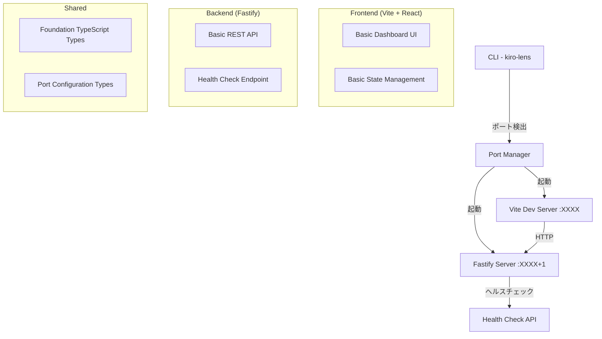

# 設計ドキュメント

## 概要

kiro-lens-foundationは、Kiro IDEの.kiro配下ファイル管理ツールの基盤となるモノレポ構成のローカル開発ツールです。Vite + React + TypeScript（フロントエンド）とFastify + TypeScript（バックエンド）を使用し、デフォルトでランダムポート割り当てを行うことで複数プロジェクトでの同時起動をサポートします。

## アーキテクチャ

### システム構成図



### 技術スタック

**フロントエンド**
- React: `18.3.1`
- TypeScript: `5.7.2`
- Vite: `6.0.1`
- Tailwind CSS: `3.4.15`

**バックエンド**
- Fastify: `5.1.0`
- TypeScript: `5.7.2`

**開発ツール**
- tsx: `4.20.4` (TypeScript実行)
- Concurrently: `9.1.0` (並行実行)
- Commander.js: `12.1.0` (CLI)

## コンポーネントとインターフェース

### プロジェクト構造

```
kiro-lens/
├── package.json                    # ワークスペース設定
├── bin/
│   └── kiro-lens.ts               # CLI エントリーポイント
├── packages/
│   ├── frontend/                  # Vite + React アプリ
│   │   ├── src/
│   │   │   ├── components/
│   │   │   │   ├── Dashboard.tsx  # 基本ダッシュボード
│   │   │   │   ├── Header.tsx     # ヘッダー
│   │   │   │   ├── Sidebar.tsx    # 基本サイドバー
│   │   │   │   └── MainContent.tsx # 基本メインコンテンツ
│   │   │   ├── hooks/
│   │   │   │   └── useHealth.ts   # ヘルスチェック
│   │   │   ├── services/
│   │   │   │   └── api.ts         # 基本API通信
│   │   │   ├── App.tsx
│   │   │   └── main.tsx
│   │   ├── package.json
│   │   ├── vite.config.ts
│   │   ├── tailwind.config.js
│   │   └── tsconfig.json
│   ├── backend/                   # Fastify API サーバー
│   │   ├── src/
│   │   │   ├── routes/
│   │   │   │   └── health.ts      # ヘルスチェックAPI
│   │   │   ├── services/
│   │   │   │   └── portManager.ts # ポート管理
│   │   │   ├── plugins/
│   │   │   │   └── cors.ts        # CORS設定
│   │   │   ├── app.ts             # アプリケーション設定
│   │   │   └── server.ts          # サーバー起動
│   │   ├── package.json
│   │   └── tsconfig.json
│   └── shared/                    # 共通型定義
│       ├── src/
│       │   └── types/
│       │       ├── port.ts        # ポート設定型
│       │       ├── health.ts      # ヘルスチェック型
│       │       └── api.ts         # 基本API型
│       ├── package.json
│       └── tsconfig.json
├── tsconfig.json                  # ルート TypeScript 設定
└── README.md
```

### CLI設計

#### コマンドライン引数

```typescript
interface CLIOptions {
  port?: number;              // -p, --port
  frontendPort?: number;      // -f, --frontend-port
  backendPort?: number;       // -b, --backend-port
  noOpen?: boolean;          // --no-open
  verbose?: boolean;         // -v, --verbose
}

// Commander.js設定
program
  .name('kiro-lens')
  .description('Kiro IDE .kiro directory browser and editor')
  .version('1.0.0')
  .option('-p, --port <number>', 'Frontend port (backend will be port+1)')
  .option('-f, --frontend-port <number>', 'Frontend port')
  .option('-b, --backend-port <number>', 'Backend port')
  .option('--no-open', 'Don\'t open browser automatically')
  .option('-v, --verbose', 'Verbose logging')
  .action(async (options: CLIOptions) => {
    await startKiroLens(options);
  });
```

#### ポート管理システム

```typescript
interface PortConfig {
  frontend: number;
  backend: number;
  autoDetected: boolean;
}

class PortManager {
  // デフォルト: ランダムポート検出
  async detectPorts(options: CLIOptions): Promise<PortConfig> {
    if (options.frontendPort && options.backendPort) {
      // 両方指定済み
      return await this.validatePorts(options.frontendPort, options.backendPort);
    }
    
    if (options.port) {
      // フロントエンドのみ指定
      const frontend = options.port;
      const backend = await this.findAvailablePort(frontend + 1);
      return { frontend, backend, autoDetected: false };
    }
    
    // 完全自動検出（デフォルト）
    const frontend = await this.findAvailablePort(8000);
    const backend = await this.findAvailablePort(frontend + 1);
    return { frontend, backend, autoDetected: true };
  }
  
  private async findAvailablePort(startPort: number): Promise<number> {
    // 指定ポートから順番に利用可能ポートを検索
  }
  
  private async validatePorts(frontend: number, backend: number): Promise<PortConfig> {
    // 指定ポートの利用可能性をチェック
  }
}
```

### フロントエンド コンポーネント設計

#### Dashboard.tsx (メインコンポーネント)
```typescript
interface DashboardProps {
  projectName: string;
}

const Dashboard: React.FC<DashboardProps> = ({ projectName }) => {
  const { isHealthy, isLoading } = useHealth();
  
  return (
    <div className="h-screen flex flex-col">
      <Header projectName={projectName} isHealthy={isHealthy} />
      <div className="flex flex-1">
        <Sidebar />
        <MainContent />
      </div>
    </div>
  );
};
```

#### Header.tsx (ヘッダー)
```typescript
interface HeaderProps {
  projectName: string;
  isHealthy: boolean;
}

const Header: React.FC<HeaderProps> = ({ projectName, isHealthy }) => {
  return (
    <header className="bg-gray-800 text-white p-4 flex justify-between items-center">
      <h1 className="text-xl font-bold">kiro-lens - {projectName}</h1>
      <div className="flex items-center gap-2">
        <span className={`text-sm ${isHealthy ? 'text-green-400' : 'text-red-400'}`}>
          {isHealthy ? '✅ Connected' : '❌ Disconnected'}
        </span>
      </div>
    </header>
  );
};
```

#### Sidebar.tsx (基本サイドバー)
```typescript
interface SidebarProps {
  hasKiroDir: boolean;
}

const Sidebar: React.FC<SidebarProps> = ({ hasKiroDir }) => {
  return (
    <aside className="w-64 bg-gray-100 border-r border-gray-300 p-4">
      <h2 className="text-lg font-semibold mb-4">Project Files</h2>
      {hasKiroDir ? (
        <div className="flex items-center gap-2">
          <span>📁</span>
          <span>.kiro</span>
        </div>
      ) : (
        <div className="text-gray-500 text-sm">
          No .kiro directory found
        </div>
      )}
    </aside>
  );
};
```

### バックエンド API 設計

#### ヘルスチェックAPI

```typescript
// GET /api/health - サーバー状態確認
interface HealthResponse {
  status: 'healthy' | 'unhealthy';
  timestamp: string;
  version: string;
  uptime: number;
}

// Fastify ルート実装
export async function healthRoutes(fastify: FastifyInstance) {
  fastify.get('/api/health', async (request, reply) => {
    const response: HealthResponse = {
      status: 'healthy',
      timestamp: new Date().toISOString(),
      version: '1.0.0',
      uptime: process.uptime()
    };
    
    return response;
  });
}
```

#### プロジェクト情報API

```typescript
// GET /api/project - プロジェクト基本情報
interface ProjectResponse {
  name: string;
  hasKiroDir: boolean;
  kiroPath?: string;
}

export async function projectRoutes(fastify: FastifyInstance) {
  fastify.get('/api/project', async (request, reply) => {
    const projectName = path.basename(process.cwd());
    const kiroPath = path.join(process.cwd(), '.kiro');
    const hasKiroDir = await fs.pathExists(kiroPath);
    
    const response: ProjectResponse = {
      name: projectName,
      hasKiroDir,
      kiroPath: hasKiroDir ? kiroPath : undefined
    };
    
    return response;
  });
}
```

## データモデル

### ポート設定

```typescript
interface PortConfiguration {
  frontend: number;
  backend: number;
  autoDetected: boolean;
  requestedPorts?: {
    frontend?: number;
    backend?: number;
  };
}

interface PortValidationResult {
  isAvailable: boolean;
  conflictingProcess?: string;
  suggestedAlternative?: number;
}
```

### プロジェクト情報

```typescript
interface ProjectInfo {
  name: string;
  path: string;
  hasKiroDirectory: boolean;
  kiroPath?: string;
}

interface ServerStatus {
  frontend: {
    port: number;
    url: string;
    status: 'running' | 'stopped' | 'error';
  };
  backend: {
    port: number;
    url: string;
    status: 'running' | 'stopped' | 'error';
  };
}
```

## エラーハンドリング

### エラー分類と処理戦略

```typescript
enum FoundationErrorType {
  PORT_IN_USE = 'PORT_IN_USE',
  PORT_PERMISSION_DENIED = 'PORT_PERMISSION_DENIED',
  KIRO_DIR_NOT_FOUND = 'KIRO_DIR_NOT_FOUND',
  SERVER_START_FAILED = 'SERVER_START_FAILED',
  INVALID_PROJECT_DIR = 'INVALID_PROJECT_DIR'
}

interface FoundationError {
  type: FoundationErrorType;
  message: string;
  details?: any;
  timestamp: Date;
  recoverable: boolean;
  suggestedAction?: string;
}
```

### エラー処理フロー

1. **ポート競合エラー**: 代替ポート提案と自動検出
2. **権限エラー**: 管理者権限の必要性を説明
3. **プロジェクトディレクトリエラー**: 正しいディレクトリでの実行を促す
4. **サーバー起動エラー**: 詳細なログと復旧手順を提供

## テスト戦略

### フロントエンド テスト

```typescript
// コンポーネントテスト (Vitest + React Testing Library)
describe('Dashboard', () => {
  test('プロジェクト名が正しく表示される', () => {
    render(<Dashboard projectName="test-project" />);
    expect(screen.getByText(/test-project/)).toBeInTheDocument();
  });
  
  test('ヘルスチェック状態が表示される', () => {
    // テスト実装
  });
});

// カスタムフックテスト
describe('useHealth', () => {
  test('ヘルスチェックAPIを正しく呼び出す', () => {
    // テスト実装
  });
});
```

### バックエンド テスト

```typescript
// API エンドポイントテスト (Vitest + Supertest)
describe('Health API', () => {
  test('GET /api/health - 正常なレスポンスを返す', async () => {
    const response = await request(app)
      .get('/api/health')
      .expect(200);
      
    expect(response.body.status).toBe('healthy');
  });
});

// ポート管理テスト
describe('PortManager', () => {
  test('利用可能ポートを正しく検出する', async () => {
    // テスト実装
  });
});
```

### 統合テスト

```typescript
// CLI統合テスト
describe('CLI Integration', () => {
  test('npx kiro-lens でサーバーが起動する', async () => {
    // テスト実装
  });
  
  test('ポート指定オプションが正しく動作する', async () => {
    // テスト実装
  });
});
```

## パフォーマンス考慮事項

### 起動時間最適化

1. **並行起動**: フロントエンドとバックエンドの並行起動
2. **ポート検出最適化**: 効率的なポート検索アルゴリズム
3. **依存関係最小化**: 必要最小限のパッケージのみ使用

### メモリ使用量

1. **軽量実装**: 基本機能のみの実装でメモリ使用量を最小化
2. **リソース管理**: 適切なクリーンアップ処理

## セキュリティ考慮事項

### ネットワークセキュリティ

1. **CORS設定**: 適切なオリジン制限
2. **ローカルホスト制限**: 外部からのアクセスを制限
3. **ポート範囲制限**: 安全なポート範囲での動作

### ファイルアクセス制御

1. **プロジェクトディレクトリ制限**: 実行ディレクトリ配下のみアクセス許可
2. **基本的な権限チェック**: ファイル読み取り権限の確認