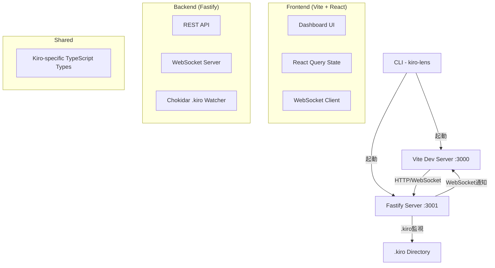

# 設計ドキュメント

## 概要

kiro-lensは、AWS開発のKiro IDEで作成される.kiro配下のファイル（スペック、ステアリング、設定等）をブラウザ上で管理・編集するためのローカル開発ツールです。Vite + React + TypeScript（フロントエンド）とFastify + TypeScript（バックエンド）を使用したモノレポ構成で、WebSocketを使用したリアルタイム通信により、.kiro配下のファイルシステム変更を即座にブラウザに反映し、Kiro IDE利用者に優れた開発体験を提供します。

## アーキテクチャ

### システム構成図



### 技術スタック（最新安定版）

**フロントエンド**
- React: `18.3.1` (最新安定版)
- TypeScript: `5.7.2` (最新安定版)
- Vite: `6.0.1` (最新安定版)
- Tailwind CSS: `3.4.15` (最新安定版)
- React Query: `5.62.2` (TanStack Query)
- Socket.io Client: `4.8.1`

**バックエンド**
- Fastify: `5.1.0` (最新安定版)
- TypeScript: `5.7.2`
- Socket.io: `4.8.1`
- Chokidar: `4.0.1`
- Gray-matter: `4.0.3`

**開発ツール**
- tsx: `4.20.4` (TypeScript実行)
- Concurrently: `9.1.0` (並行実行)
- Commander.js: `12.1.0` (CLI)

## コンポーネントとインターフェース

### プロジェクト構造

```
kiro-lens/
├── package.json                    # ワークスペース設定
├── bin/
│   └── kiro-lens.ts               # CLI エントリーポイント
├── packages/
│   ├── frontend/                  # Vite + React アプリ
│   │   ├── src/
│   │   │   ├── components/
│   │   │   │   ├── Dashboard.tsx
│   │   │   │   ├── Sidebar.tsx
│   │   │   │   ├── MainContent.tsx
│   │   │   │   └── TaskList.tsx
│   │   │   ├── hooks/
│   │   │   │   ├── useFiles.ts
│   │   │   │   ├── useWebSocket.ts
│   │   │   │   └── useFileEditor.ts
│   │   │   ├── services/
│   │   │   │   └── api.ts
│   │   │   ├── types/
│   │   │   │   └── index.ts
│   │   │   ├── App.tsx
│   │   │   └── main.tsx
│   │   ├── package.json
│   │   ├── vite.config.ts
│   │   ├── tailwind.config.js
│   │   └── tsconfig.json
│   ├── backend/                   # Fastify API サーバー
│   │   ├── src/
│   │   │   ├── routes/
│   │   │   │   ├── files.ts
│   │   │   │   └── websocket.ts
│   │   │   ├── services/
│   │   │   │   ├── kiroFileService.ts
│   │   │   │   ├── kiroWatcher.ts
│   │   │   │   └── markdownService.ts
│   │   │   ├── types/
│   │   │   │   └── index.ts
│   │   │   ├── plugins/
│   │   │   │   ├── cors.ts
│   │   │   │   └── websocket.ts
│   │   │   ├── app.ts
│   │   │   └── server.ts
│   │   ├── package.json
│   │   └── tsconfig.json
│   └── shared/                    # 共通型定義
│       ├── src/
│       │   └── types/
│       │       ├── kiroFile.ts
│       │       ├── websocket.ts
│       │       └── api.ts
│       ├── package.json
│       └── tsconfig.json
├── tsconfig.json                  # ルート TypeScript 設定
└── README.md
```

### フロントエンド コンポーネント設計

#### Dashboard.tsx (メインコンポーネント)
```typescript
interface DashboardProps {
  projectName: string;
}

const Dashboard: React.FC<DashboardProps> = ({ projectName }) => {
  // WebSocket接続管理
  // ファイル状態管理
  // レイアウト制御
}
```

#### Sidebar.tsx (.kiroファイルツリー)
```typescript
interface SidebarProps {
  kiroFiles: KiroFileTreeNode[];
  selectedFile: string | null;
  onFileSelect: (path: string) => void;
  onFolderToggle: (path: string) => void;
}

interface KiroFileTreeNode {
  name: string;
  path: string;
  type: 'file' | 'folder';
  kiroType?: 'spec' | 'steering' | 'settings' | 'hooks';
  children?: KiroFileTreeNode[];
  isExpanded?: boolean;
}
```

#### MainContent.tsx (.kiroファイル表示・編集)
```typescript
interface MainContentProps {
  selectedFile: KiroFileContent | null;
  isEditing: boolean;
  onEdit: (content: string) => void;
  onSave: () => void;
}

interface KiroFileContent {
  path: string;
  content: string;
  type: 'markdown' | 'json' | 'text';
  kiroType: 'spec' | 'steering' | 'settings' | 'hooks';
  lastModified: Date;
  frontMatter?: Record<string, any>; // Markdownファイルの場合
}
```

### バックエンド API 設計

#### REST API エンドポイント

```typescript
// GET /api/kiro/files - .kiroファイルツリー取得
interface GetKiroFilesResponse {
  files: KiroFileTreeNode[];
  projectName: string;
  kiroVersion?: string;
}

// GET /api/kiro/files/:path - .kiroファイル内容取得
interface GetKiroFileResponse {
  path: string;
  content: string;
  type: 'markdown' | 'json' | 'text';
  kiroType: 'spec' | 'steering' | 'settings' | 'hooks';
  lastModified: string;
  size: number;
  frontMatter?: Record<string, any>;
}

// PUT /api/kiro/files/:path - .kiroファイル内容更新
interface UpdateKiroFileRequest {
  content: string;
  lastModified?: string;
  preserveFrontMatter?: boolean;
}

interface UpdateKiroFileResponse {
  success: boolean;
  lastModified: string;
  kiroType: 'spec' | 'steering' | 'settings' | 'hooks';
}
```

#### WebSocket イベント

```typescript
// クライアント → サーバー
interface ClientEvents {
  'kiro:watch': (path: string) => void;
  'kiro:unwatch': (path: string) => void;
  'kiro:edit:start': (path: string) => void;
  'kiro:edit:end': (path: string) => void;
}

// サーバー → クライアント
interface ServerEvents {
  'kiro:changed': (data: KiroFileChangeEvent) => void;
  'kiro:created': (data: KiroFileCreateEvent) => void;
  'kiro:deleted': (data: KiroFileDeleteEvent) => void;
  'kiro:conflict': (data: KiroFileConflictEvent) => void;
}

interface KiroFileChangeEvent {
  path: string;
  content: string;
  lastModified: string;
  changeType: 'content' | 'rename' | 'move';
  kiroType: 'spec' | 'steering' | 'settings' | 'hooks';
}
```

## データモデル

### .kiroファイルシステム抽象化

```typescript
interface KiroFileSystemNode {
  name: string;
  path: string;
  type: 'file' | 'directory';
  kiroType: 'spec' | 'steering' | 'settings' | 'hooks';
  size?: number;
  lastModified: Date;
  isHidden: boolean;
  children?: KiroFileSystemNode[];
}

interface KiroFileMetadata {
  path: string;
  encoding: string;
  mimeType: string;
  kiroType: 'spec' | 'steering' | 'settings' | 'hooks';
  isReadable: boolean;
  isWritable: boolean;
  stats: {
    size: number;
    created: Date;
    modified: Date;
    accessed: Date;
  };
  frontMatter?: Record<string, any>; // Markdownファイルの場合
}
```

### Kiro Markdown 処理

```typescript
interface KiroMarkdownFile {
  frontMatter: Record<string, any>;
  content: string;
  rawContent: string;
  htmlContent: string;
  kiroType: 'spec' | 'steering';
  tableOfContents?: TOCItem[];
  taskList?: TaskItem[]; // tasks.mdの場合
}

interface TaskItem {
  id: string;
  text: string;
  completed: boolean;
  level: number;
  children?: TaskItem[];
}

interface TOCItem {
  level: number;
  title: string;
  anchor: string;
  children?: TOCItem[];
}
```

## エラーハンドリング

### エラー分類と処理戦略

```typescript
enum KiroErrorType {
  KIRO_DIR_NOT_FOUND = 'KIRO_DIR_NOT_FOUND',
  KIRO_FILE_NOT_FOUND = 'KIRO_FILE_NOT_FOUND',
  PERMISSION_DENIED = 'PERMISSION_DENIED',
  FILE_TOO_LARGE = 'FILE_TOO_LARGE',
  INVALID_KIRO_FILE_TYPE = 'INVALID_KIRO_FILE_TYPE',
  WEBSOCKET_CONNECTION_FAILED = 'WEBSOCKET_CONNECTION_FAILED',
  KIRO_FILE_CONFLICT = 'KIRO_FILE_CONFLICT',
  NETWORK_ERROR = 'NETWORK_ERROR',
  INVALID_FRONTMATTER = 'INVALID_FRONTMATTER'
}

interface KiroAppError {
  type: KiroErrorType;
  message: string;
  details?: any;
  timestamp: Date;
  recoverable: boolean;
  kiroContext?: {
    fileType: 'spec' | 'steering' | 'settings' | 'hooks';
    operation: 'read' | 'write' | 'watch';
  };
}
```

### エラー処理フロー

1. **.kiroディレクトリエラー**: .kiroディレクトリの存在確認、アクセス権限チェック
2. **.kiroファイル操作エラー**: ファイルアクセス権限、存在確認、サイズ制限
3. **ネットワークエラー**: WebSocket再接続、API リトライ機構
4. **競合エラー**: .kiroファイル編集競合の検出と解決オプション提示
5. **バリデーションエラー**: Markdownフロントマター、JSON設定ファイルの妥当性チェック

## テスト戦略

### フロントエンド テスト

```typescript
// コンポーネントテスト (Vitest + React Testing Library)
describe('Dashboard', () => {
  test('.kiroファイル選択時にメインコンテンツが更新される', () => {
    // テスト実装
  });
});

// カスタムフックテスト
describe('useKiroFiles', () => {
  test('.kiroファイル一覧を正しく取得する', () => {
    // テスト実装
  });
});
```

### バックエンド テスト

```typescript
// API エンドポイントテスト (Vitest + Supertest)
describe('Kiro Files API', () => {
  test('GET /api/kiro/files - .kiroファイル一覧を返す', async () => {
    // テスト実装
  });
});

// サービス層テスト
describe('KiroFileService', () => {
  test('.kiroファイル内容を正しく読み込む', () => {
    // テスト実装
  });
});
```

### E2E テスト

```typescript
// Playwright を使用したE2Eテスト
describe('.kiroファイル編集フロー', () => {
  test('.kiroファイル選択から編集、保存まで', async ({ page }) => {
    // テスト実装
  });
});
```

## パフォーマンス最適化

### フロントエンド最適化

1. **仮想化**: 大量ファイル表示時のReact Window使用
2. **メモ化**: React.memo、useMemo、useCallbackの適切な使用
3. **コード分割**: React.lazy による動的インポート
4. **状態最適化**: React Query によるサーバー状態管理

### バックエンド最適化

1. **.kiro監視最適化**: chokidar の .kiro ディレクトリ特化設定、ignoreInitial、ignored オプション
2. **メモリ管理**: 大きな.kiroファイルのストリーミング処理
3. **WebSocket最適化**: 接続プール、メッセージバッファリング
4. **キャッシュ戦略**: .kiroファイルメタデータとフロントマターのメモリキャッシュ

## セキュリティ考慮事項

### .kiroファイルアクセス制御

1. **.kiroディレクトリ制限**: .kiro配下のファイルのみアクセス許可
2. **パストラバーサル防止**: path.resolve() による正規化と.kiro配下チェック
3. **ファイルタイプ制限**: .md、.json、.txt ファイルのみ編集許可
4. **サイズ制限**: 大きな.kiroファイルの読み込み制限
5. **権限チェック**: .kiroファイル読み書き権限の事前確認

### ネットワークセキュリティ

1. **CORS設定**: 適切なオリジン制限
2. **入力検証**: ファイルパス、内容の妥当性チェック
3. **レート制限**: API呼び出し頻度の制限
4. **WebSocket認証**: 接続時の簡易認証機構