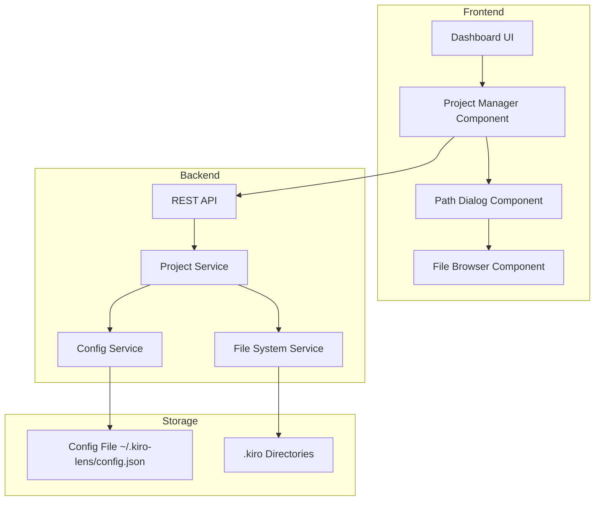

# Design Document

## Overview

パス管理システムは、kiro-lensが複数のプロジェクトの.kiroディレクトリを管理できるようにする機能です。現在の単一プロジェクト管理から、ユーザーが任意のパスを指定して複数のプロジェクトを管理できるシステムに拡張します。

主要な改善点：

- UIベースでのプロジェクトパス追加機能
- 複数プロジェクトの同時管理
- 設定の永続化（ユーザーホームディレクトリの.kiro-lensフォルダ）
- ファイルシステムブラウザによる直感的なパス選択

## Architecture

### システム構成図



### データフロー

1. **プロジェクト追加フロー**
   - ユーザーがUIでプロジェクト追加をクリック
   - パス入力ダイアログが表示
   - ファイルブラウザまたは手動入力でパスを選択
   - バックエンドで.kiroディレクトリの存在確認
   - 設定ファイルに保存
   - プロジェクトリストを更新

2. **プロジェクト切り替えフロー**
   - ユーザーがプロジェクトリストから選択
   - 選択されたプロジェクトの.kiroディレクトリを読み込み
   - ファイルツリーを更新

3. **設定永続化フロー**
   - アプリケーション起動時に設定ファイルを読み込み
   - プロジェクト追加/削除時に設定ファイルを更新
   - 設定ファイルの整合性チェック

## Components and Interfaces

### Frontend Components

#### ProjectManager Component

```typescript
interface ProjectManagerProps {
  onProjectSelect: (project: ProjectInfo) => void;
  currentProject?: ProjectInfo;
}

interface ProjectManagerState {
  projects: ProjectInfo[];
  isLoading: boolean;
  error?: string;
}
```

#### PathDialog Component

```typescript
interface PathDialogProps {
  isOpen: boolean;
  onClose: () => void;
  onConfirm: (path: string) => Promise<void>;
}

interface PathDialogState {
  inputPath: string;
  isValidating: boolean;
  validationError?: string;
  suggestions: string[];
}
```

#### FileBrowser Component

```typescript
interface FileBrowserProps {
  onPathSelect: (path: string) => void;
  initialPath?: string;
}

// Web File System Access API を使用
interface FileBrowserAPI {
  showDirectoryPicker(): Promise<FileSystemDirectoryHandle>;
  isSupported(): boolean;
}
```

### Backend Services

#### ProjectService

```typescript
// プロジェクト管理関数
export async function getAllProjects(): Promise<ProjectInfo[]>;
export async function addProject(path: string): Promise<ProjectInfo>;
export async function removeProject(id: string): Promise<void>;
export async function validateProjectPath(path: string): Promise<ValidationResult>;

// .kiroディレクトリ操作関数
export async function getKiroContents(projectId: string): Promise<FileItem[]>;
export async function switchProject(projectId: string): Promise<ProjectInfo>;

interface ValidationResult {
  isValid: boolean;
  error?: string;
  resolvedPath?: string;
  hasKiroDir?: boolean;
}
```

#### ConfigService

```typescript
// 設定ファイル管理関数
export async function loadConfig(): Promise<AppConfig>;
export async function saveConfig(config: AppConfig): Promise<void>;
export async function resetConfig(): Promise<void>;

// 設定ファイルの整合性関数
export async function validateConfig(config: unknown): Promise<AppConfig>;
export async function migrateConfig(oldConfig: unknown): Promise<AppConfig>;

interface AppConfig {
  version: string;
  projects: ProjectInfo[];
  settings: {
    lastSelectedProject?: string;
    theme?: string;
    autoSave?: boolean;
  };
  createdAt: string;
  updatedAt: string;
}
```

#### FileSystemService

```typescript
// パス操作関数
export async function resolvePath(inputPath: string): Promise<string>;
export async function checkDirectoryExists(path: string): Promise<boolean>;
export async function checkKiroDirectory(path: string): Promise<boolean>;

// ファイルシステム情報関数
export async function getDirectoryInfo(path: string): Promise<DirectoryInfo>;
export async function suggestPaths(partial: string): Promise<string[]>;

interface DirectoryInfo {
  path: string;
  exists: boolean;
  isDirectory: boolean;
  hasKiroDir: boolean;
  permissions: {
    read: boolean;
    write: boolean;
  };
}
```

## Data Models

### 拡張されたProjectInfo

```typescript
interface ProjectInfo {
  id: string; // UUID
  name: string;
  path: string; // プロジェクトルートパス
  kiroPath: string; // .kiroディレクトリの絶対パス
  hasKiroDir: boolean;
  isValid: boolean; // パスが現在も有効かどうか
  addedAt: string; // ISO 8601
  lastAccessedAt?: string; // ISO 8601
}
```

### 設定ファイル構造

```typescript
interface AppConfig {
  version: string; // セマンティックバージョニング
  projects: ProjectInfo[];
  settings: {
    lastSelectedProject?: string;
    theme: 'light' | 'dark' | 'system';
    autoSave: boolean;
    maxRecentProjects: number;
  };
  metadata: {
    createdAt: string;
    updatedAt: string;
    configPath: string;
  };
}
```

### API Request/Response Types

```typescript
// プロジェクト追加リクエスト
interface AddProjectRequest {
  path: string;
}

interface AddProjectResponse {
  project: ProjectInfo;
  message: string;
}

// プロジェクト一覧レスポンス
interface ProjectListResponse {
  projects: ProjectInfo[];
  currentProject?: ProjectInfo;
}

// パス検証レスポンス
interface ValidatePathResponse {
  isValid: boolean;
  error?: string;
  resolvedPath?: string;
  directoryInfo?: DirectoryInfo;
}
```

## Error Handling

### エラー分類と対応

#### 1. パス関連エラー

- **存在しないパス**: 適切なエラーメッセージとパス修正の提案
- **アクセス権限エラー**: 権限不足の説明と解決方法の提示
- **.kiroディレクトリなし**: .kiroディレクトリ作成の提案

#### 2. 設定ファイルエラー

- **設定ファイル破損**: バックアップからの復元またはデフォルト設定での初期化
- **バージョン不整合**: 自動マイグレーション処理
- **書き込み権限エラー**: 代替保存場所の提案

#### 3. ファイルシステムエラー

- **ディスク容量不足**: 容量確認と清理の提案
- **ファイルロック**: 再試行機能の提供
- **ネットワークドライブエラー**: ローカルパスの推奨

### エラーハンドリング戦略

```typescript
interface ErrorHandler {
  handlePathError(error: PathError): UserFriendlyError;
  handleConfigError(error: ConfigError): RecoveryAction;
  handleFileSystemError(error: FileSystemError): RetryStrategy;
}

interface UserFriendlyError {
  title: string;
  message: string;
  suggestions: string[];
  severity: 'info' | 'warning' | 'error';
}

interface RecoveryAction {
  type: 'retry' | 'reset' | 'migrate' | 'ignore';
  description: string;
  autoExecute: boolean;
}
```

## Testing Strategy

### 単体テスト

- **ConfigService**: 設定ファイルの読み書き、バリデーション、マイグレーション
- **ProjectService**: プロジェクト管理、パス検証、.kiroディレクトリ操作
- **FileSystemService**: パス解決、ディレクトリ存在確認、権限チェック

### 統合テスト

- **API エンドポイント**: プロジェクト追加/削除/切り替えのフルフロー
- **設定永続化**: アプリケーション再起動時の設定復元
- **エラーハンドリング**: 各種エラーケースでの適切な処理

### E2Eテスト

- **プロジェクト管理フロー**: UI操作によるプロジェクト追加から切り替えまで
- **ファイルブラウザ**: ディレクトリ選択機能の動作確認
- **設定永続化**: アプリケーション再起動後の状態復元

### テスト環境構築

```typescript
// テスト用の一時設定ディレクトリ
interface TestEnvironment {
  tempConfigDir: string;
  mockProjects: ProjectInfo[];
  cleanupFunctions: (() => Promise<void>)[];
}

// モックファイルシステム
interface MockFileSystem {
  createTempProject(name: string): Promise<string>;
  createKiroDirectory(projectPath: string): Promise<void>;
  removeProject(projectPath: string): Promise<void>;
}
```

## Performance Considerations

### 最適化戦略

#### 1. 設定ファイル管理

- **遅延読み込み**: アプリケーション起動時の最小限読み込み
- **差分更新**: 変更された部分のみの保存
- **キャッシュ機能**: メモリ内での設定情報キャッシュ

#### 2. ファイルシステム操作

- **非同期処理**: UI ブロッキングの回避
- **バッチ処理**: 複数パスの一括検証
- **タイムアウト設定**: 長時間の処理に対する制限

#### 3. UI レスポンシブネス

- **プログレッシブローディング**: 段階的なデータ表示
- **仮想化**: 大量プロジェクトリストの効率的表示
- **デバウンス**: パス入力時の過度なAPI呼び出し抑制

### メモリ管理

```typescript
interface MemoryManager {
  // プロジェクト情報のキャッシュ管理
  cacheProject(project: ProjectInfo): void;
  evictProject(projectId: string): void;
  clearCache(): void;

  // メモリ使用量監視
  getMemoryUsage(): MemoryUsage;
  optimizeMemory(): Promise<void>;
}

interface MemoryUsage {
  totalProjects: number;
  cachedProjects: number;
  memoryFootprint: number; // bytes
}
```

## Security Considerations

### セキュリティ要件

#### 1. ファイルシステムアクセス制御

- **パス検証**: ディレクトリトラバーサル攻撃の防止
- **権限チェック**: 読み書き権限の事前確認
- **サンドボックス**: .kiroディレクトリ外へのアクセス制限

#### 2. 設定ファイルセキュリティ

- **ファイル権限**: 600 (所有者のみ読み書き可能)
- **入力検証**: 設定値の厳密なバリデーション
- **暗号化**: 機密情報の暗号化保存（将来拡張）

#### 3. Web セキュリティ

- **CORS設定**: 適切なオリジン制限
- **CSP**: Content Security Policy の設定
- **File System Access API**: ユーザー操作による明示的な許可

### セキュリティ実装

```typescript
interface SecurityValidator {
  // パスセキュリティ
  validatePath(path: string): SecurityValidationResult;
  sanitizePath(path: string): string;
  checkPathPermissions(path: string): Promise<PathPermissions>;

  // 設定ファイルセキュリティ
  validateConfigData(data: unknown): ConfigValidationResult;
  setSecureFilePermissions(filePath: string): Promise<void>;
}

interface SecurityValidationResult {
  isSecure: boolean;
  risks: SecurityRisk[];
  sanitizedValue?: string;
}

interface SecurityRisk {
  type: 'path_traversal' | 'permission_denied' | 'suspicious_path';
  severity: 'low' | 'medium' | 'high';
  description: string;
}
```

## Migration Strategy

### 既存データからの移行

#### 1. 現在の単一プロジェクト設定

- 現在の`process.cwd()`ベースの設定を最初のプロジェクトとして自動追加
- 既存の.kiroディレクトリを新しいプロジェクト管理システムに統合

#### 2. 設定ファイルバージョニング

```typescript
interface ConfigMigration {
  version: string;
  migrate(oldConfig: unknown): Promise<AppConfig>;
  validate(config: AppConfig): boolean;
}

// バージョン別マイグレーション
const migrations: Record<string, ConfigMigration> = {
  '1.0.0': {
    version: '1.0.0',
    migrate: async oldConfig => {
      // 初期バージョンからの移行
      return createDefaultConfig();
    },
    validate: config => validateV1Config(config),
  },
  '1.1.0': {
    version: '1.1.0',
    migrate: async oldConfig => {
      // 新機能追加時の移行
      return addNewFields(oldConfig as AppConfig);
    },
    validate: config => validateV1_1Config(config),
  },
};
```

#### 3. 段階的ロールアウト

- **フェーズ1**: 設定ファイル作成と基本的なプロジェクト管理
- **フェーズ2**: UI改善とファイルブラウザ統合
- **フェーズ3**: 高度な機能（プロジェクトテンプレート、同期機能等）

## Future Enhancements

### 拡張可能性を考慮した設計

#### 1. プロジェクトテンプレート機能

- よく使用するプロジェクト構造のテンプレート化
- .kiroディレクトリの初期化テンプレート

#### 2. 同期・バックアップ機能

- クラウドストレージとの設定同期
- プロジェクト設定の自動バックアップ

#### 3. 高度な検索・フィルタリング

- プロジェクト名、パス、タグによる検索
- 最近使用したプロジェクトの優先表示

#### 4. チーム機能

- プロジェクト設定の共有
- チームメンバーとの.kiroディレクトリ同期
