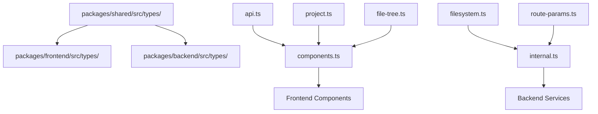

# 設計ドキュメント

## 概要

kiro-lensプロジェクトの型定義統合システムは、現在分散している型定義を`packages/shared`パッケージに集約し、TypeScriptの型安全性を最大限活用した開発環境を構築します。重複型定義の解消、共通型の統合、パッケージ固有型の適切な配置を通じて、保守性と開発体験を向上させます。

## アーキテクチャ

### 型定義の階層構造

```
packages/shared/src/types/
├── api.ts              # API関連型（既存）
├── project.ts          # プロジェクト関連型（既存）
├── config.ts           # 設定関連型（既存）
├── file-tree.ts        # ファイルツリー関連型（既存）
├── health.ts           # ヘルスチェック関連型（既存）
├── filesystem.ts       # ファイルシステム関連型（新規）
└── route-params.ts     # ルートパラメータ関連型（新規）
```

### 型定義の分類と配置戦略

```
┌─────────────────────────────────────────────────────────────┐
│                    Shared Types                             │
│  ┌─────────────────┐  ┌─────────────────┐  ┌──────────────┐ │
│  │   API Types     │  │  Domain Types   │  │ Common Types │ │
│  │                 │  │                 │  │              │ │
│  │ • ApiResponse   │  │ • ProjectInfo   │  │ • FileItem   │ │
│  │ • ApiError      │  │ • AppConfig     │  │ • Health     │ │
│  │ • Request/      │  │ • Settings      │  │ • Validation │ │
│  │   Response      │  │                 │  │              │ │
│  └─────────────────┘  └─────────────────┘  └──────────────┘ │
└─────────────────────────────────────────────────────────────┘
           ▲                        ▲                        ▲
           │                        │                        │
┌──────────┴──────────┐   ┌─────────┴─────────┐   ┌─────────┴──────────┐
│   Frontend Types    │   │   Backend Types   │   │   Test Types       │
│                     │   │                   │   │                    │
│ • Component Props   │   │ • Route Handlers  │   │ • Mock Data        │
│ • Store State       │   │ • Service Config  │   │ • Test Utilities   │
│ • UI Specific       │   │ • Internal Logic  │   │                    │
└─────────────────────┘   └───────────────────┘   └────────────────────┘
```

## コンポーネント設計

### 1. 共通型定義の統合

#### 新規ファイルシステム型定義

```typescript
// packages/shared/src/types/filesystem.ts
/**
 * ディレクトリ権限情報
 *
 * ファイルシステムアクセス時の権限チェック結果を表します。
 */
export interface DirectoryPermissions {
  /** 読み取り可能かどうか */
  readonly readable: boolean;
  /** 書き込み可能かどうか */
  readonly writable: boolean;
  /** 実行可能かどうか */
  readonly executable: boolean;
}

/**
 * ファイルシステム操作エラー
 *
 * ファイルシステム操作で発生する可能性のあるエラーの種類を定義します。
 */
export type FileSystemErrorType =
  | 'PERMISSION_DENIED'
  | 'NOT_FOUND'
  | 'ALREADY_EXISTS'
  | 'INVALID_PATH'
  | 'DISK_FULL'
  | 'IO_ERROR';

/**
 * ファイルシステム操作エラー詳細
 */
export interface FileSystemError {
  /** エラータイプ */
  readonly type: FileSystemErrorType;
  /** エラーメッセージ */
  readonly message: string;
  /** 対象パス */
  readonly path: string;
  /** システムエラーコード */
  readonly code?: string;
}
```

#### 新規ルートパラメータ型定義

```typescript
// packages/shared/src/types/route-params.ts
/**
 * APIルートパラメータの型定義
 *
 * 各APIエンドポイントで使用されるパラメータの型を統一管理します。
 */

/**
 * プロジェクトファイル取得APIのパラメータ
 * GET /api/projects/:id/files
 */
export interface ProjectFilesParams {
  /** プロジェクトID */
  readonly id: string;
}

/**
 * プロジェクト選択APIのパラメータ
 * POST /api/projects/:id/select
 */
export interface ProjectSelectParams {
  /** プロジェクトID */
  readonly id: string;
}

/**
 * プロジェクト削除APIのパラメータ
 * DELETE /api/projects/:id
 */
export interface ProjectDeleteParams {
  /** プロジェクトID */
  readonly id: string;
}

/**
 * 共通のIDパラメータ型
 */
export interface IdParams {
  /** リソースID */
  readonly id: string;
}
```

### 2. 重複型定義の解消

#### ValidationResult型の統合

現在の状況：

- `packages/shared/src/types/api.ts` に定義済み
- `packages/backend/src/services/projectService.ts` に重複定義

解決策：

```typescript
// packages/shared/src/types/api.ts (既存を拡張)
/**
 * パス検証結果
 *
 * プロジェクトパスやファイルパスの検証結果を表します。
 * バックエンドとフロントエンドで共通して使用されます。
 */
export interface ValidationResult {
  /** 検証が成功したかどうか */
  readonly isValid: boolean;
  /** エラーメッセージ（検証失敗時） */
  readonly error?: string;
  /** 検証されたパス（成功時） */
  readonly validatedPath?: string;
  /** 検証の詳細情報（オプション） */
  readonly details?: {
    /** 存在チェック結果 */
    readonly exists: boolean;
    /** 権限チェック結果 */
    readonly permissions: DirectoryPermissions;
    /** .kiroディレクトリの存在 */
    readonly hasKiroDir: boolean;
  };
}
```

### 3. パッケージ固有型の整理

#### フロントエンド固有型

```typescript
// packages/frontend/src/types/components.ts (新規)
import type { FileItem } from '@kiro-lens/shared';

/**
 * ファイルツリーコンポーネントのプロパティ
 */
export interface FileTreeProps {
  /** 表示するファイルアイテムのリスト */
  items: FileItem[];
  /** ファイル選択時のコールバック */
  onFileSelect?: (file: FileItem) => void;
  /** 展開状態の管理 */
  expandedIds?: Set<string>;
  /** 展開状態変更のコールバック */
  onExpandedChange?: (expandedIds: Set<string>) => void;
}

/**
 * ファイルツリーアイテムのプロパティ
 */
export interface FileTreeItemProps {
  /** 表示するファイルアイテム */
  item: FileItem;
  /** インデントレベル */
  level: number;
  /** 選択されているファイルのID */
  selectedFileId?: string;
  /** ファイル選択時のコールバック */
  onFileSelect?: (file: FileItem) => void;
  /** フォルダ展開切り替えのコールバック */
  onFolderToggle?: (folderId: string, isExpanded: boolean) => void;
}

/**
 * プロジェクトストアの状態
 */
export interface ProjectState {
  /** プロジェクト一覧 */
  projects: ProjectInfo[];
  /** 現在選択中のプロジェクト */
  currentProject: ProjectInfo | null;
  /** 選択中のファイル */
  selectedFile: FileItem | null;
  /** ローディング状態 */
  isLoading: boolean;
  /** エラー状態 */
  error: string | null;
}
```

#### バックエンド固有型

```typescript
// packages/backend/src/types/internal.ts (新規)
import type { FastifyRequest, FastifyReply } from 'fastify';
import type { ProjectFilesParams, ProjectSelectParams } from '@kiro-lens/shared';

/**
 * Fastify固有のリクエスト型
 */
export type ProjectFilesRequest = FastifyRequest<{ Params: ProjectFilesParams }>;
export type ProjectSelectRequest = FastifyRequest<{ Params: ProjectSelectParams }>;

/**
 * サービス層の設定
 */
export interface ServiceConfig {
  /** ログレベル */
  readonly logLevel: 'debug' | 'info' | 'warn' | 'error';
  /** ファイル監視の有効/無効 */
  readonly enableFileWatcher: boolean;
  /** 最大ファイル数制限 */
  readonly maxFileCount: number;
}

/**
 * ファイルツリーサービスの内部エラー
 */
export interface FileTreeServiceError {
  /** エラーコード */
  readonly code: string;
  /** エラーメッセージ */
  readonly message: string;
  /** 対象プロジェクトID */
  readonly projectId: string;
  /** 原因となったエラー */
  readonly cause?: Error;
}
```

## データフロー

### 型定義の依存関係



### インポート戦略

```typescript
// ✅ 推奨：sharedから直接インポート
import type {
  ApiResponse,
  ProjectInfo,
  ValidationResult,
  DirectoryPermissions,
} from '@kiro-lens/shared';

// ✅ 推奨：パッケージ固有型の直接インポート
import type { FileTreeProps } from '../types/components';

// ❌ 避ける：不要な中間層での再エクスポート
// packages/frontend/src/types/index.ts
export type { ProjectInfo } from '@kiro-lens/shared'; // 不要

// ❌ 避ける：他パッケージからの直接インポート
import type { SomeType } from '../../backend/src/types/internal';
```

### 不要な再エクスポートの削除

現在存在する可能性のある不要な中間層を削除：

```typescript
// ❌ 削除対象：フロントエンドでの不要な再エクスポート
// packages/frontend/src/types/index.ts
export type { ProjectInfo, ApiResponse } from '@kiro-lens/shared';

// ❌ 削除対象：バックエンドでの不要な再エクスポート
// packages/backend/src/types/index.ts
export type { ValidationResult } from '@kiro-lens/shared';

// ✅ 正しい使用法：各ファイルで直接インポート
// packages/frontend/src/components/ProjectList.tsx
import type { ProjectInfo } from '@kiro-lens/shared';

// packages/backend/src/services/projectService.ts
import type { ValidationResult } from '@kiro-lens/shared';
```

## エラーハンドリング

### 型安全なエラーハンドリング

```typescript
// packages/shared/src/types/api.ts (拡張)
/**
 * 型安全なAPIエラーハンドリング
 */
export type ApiResult<T> = { success: true; data: T } | { success: false; error: ApiError };

/**
 * バリデーション結果の型ガード
 */
export function isValidationSuccess(
  result: ValidationResult
): result is ValidationResult & { isValid: true } {
  return result.isValid;
}

/**
 * APIレスポンスの型ガード
 */
export function isApiSuccess<T>(
  response: ApiResponse<T>
): response is ApiResponse<T> & { success: true } {
  return response.success;
}
```

## 型安全性の確保

### TypeScriptコンパイラによる型チェック

型定義の整合性は、TypeScriptコンパイラの型チェック機能に依存します：

```typescript
// 型の整合性はコンパイル時に自動チェック
import type { ValidationResult } from '@kiro-lens/shared';

// 型に合わない場合はコンパイルエラーで検出
const result: ValidationResult = {
  isValid: true,
  validatedPath: '/path/to/project',
};
```

### 厳密な型チェック

TypeScriptの `--strict` モードを活用して型の不整合を検出し、型安全性を最大化します。

## マイグレーション戦略

### 段階的移行計画

#### Phase 1: 共通型の追加

1. `packages/shared/src/types/filesystem.ts` 作成
2. `packages/shared/src/types/route-params.ts` 作成
3. 既存の `api.ts` に型ガード関数追加

#### Phase 2: 重複型の解消

1. バックエンドの `ValidationResult` 削除
2. sharedからのインポートに変更
3. TypeScriptコンパイルエラーの修正

#### Phase 3: パッケージ固有型の整理

1. フロントエンドの `types/components.ts` 作成
2. バックエンドの `types/internal.ts` 作成
3. 既存型定義の移動

#### Phase 4: インポート文の統一と中間層削除

1. 全ファイルのインポート文を確認
2. sharedからの直接インポートに変更
3. 不要な中間層での再エクスポートファイルを削除
4. フロントエンド・バックエンドの `types/index.ts` で不要な再エクスポートを削除

## パフォーマンス考慮事項

### TypeScriptコンパイル最適化

```typescript
// packages/shared/src/types/index.ts (最適化)
// 型のみエクスポートでコンパイル時間短縮
export type {
  // API関連
  ApiResponse,
  ApiError,
  ValidationResult,

  // プロジェクト関連
  ProjectInfo,
  ProjectResponse,

  // ファイルシステム関連
  DirectoryPermissions,
  FileSystemError,

  // ルートパラメータ関連
  ProjectFilesParams,
  ProjectSelectParams,
} from './api';

// 型ガード関数は実行時に必要なため通常のexport
export { isValidationSuccess, isApiSuccess } from './api';
```

### バンドルサイズ最適化

```typescript
// 型のみインポートでバンドルサイズ削減
import type { ProjectInfo } from '@kiro-lens/shared';

// 実行時に必要な関数のみ通常インポート
import { isApiSuccess } from '@kiro-lens/shared';
```

## セキュリティ

### 型レベルでのセキュリティ

```typescript
// packages/shared/src/types/security.ts (新規)
/**
 * サニタイズされた文字列型
 */
export type SanitizedString = string & { readonly __sanitized: true };

/**
 * 検証済みパス型
 */
export type ValidatedPath = string & { readonly __validated: true };

/**
 * プロジェクトIDの型安全性
 */
export type ProjectId = string & { readonly __projectId: true };

/**
 * 型安全なパス作成
 */
export function createValidatedPath(path: string): ValidatedPath | null {
  // パスの検証ロジック
  if (isValidPath(path)) {
    return path as ValidatedPath;
  }
  return null;
}
```
